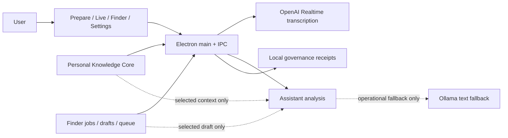

# CoqPi

<div align="center">
  
</div>

CoqPi is a local Electron app for three connected jobs:

1. help during real English/French calls with fast Russian support;
2. find and prepare job / partner / investor / accelerator targets before the call;
3. accumulate private owner/context knowledge without sending raw source material into the assistant path.

It also has a standalone `Transcribe` mode for plain meeting transcription:
microphone -> realtime speech transcript -> local Markdown/TXT export, with no
assistant analysis or reply suggestions.

OpenAI Realtime is the primary live transcription path. OpenAI text analysis is primary for assistant replies. Ollama is available only as controlled text fallback.

## Current product status

Read first for a fresh coding session:

1. `README.md`
2. `docs/ARCHITECTURE.md`
3. `docs/CORTEX_CONTEXT_CONTRACT.md`
4. task-specific docs only

### 1) Communicator: live assistant / translator

Status: MVP is real and fairly stable.

What works now:
- mic input -> realtime transcript -> assistant answer loop;
- EN/FR -> RU meaning, detected question, short answer options in EN/FR, answer meaning, keywords;
- auto-analysis after final `other` utterances with manual override;
- real-call boundary hardening for:
  - background non-EN/FR speech,
  - short noise,
  - acknowledgement noise,
  - rapid duplicate finals,
  - rapid consecutive finals that likely belong to one thought;
- stale/retry/timeout/budget diagnostics;
- selected pack + selected outreach draft flow into assistant payload;
- selected Finder/session context now adds a live communication guard:
  short spoken answers, target-specific relevance, abstain on weak context, and no broad biography dump;
- assistant output QA fixtures now verify that EN/FR suggestions use selected
  Knowledge-to-Finder facts, avoid unrelated owner facts, and switch to a
  clarifying answer when target fit is weak;
- live cockpit shows what is listened to, what is ignored, what was sent, and what context actually went into the last analyze;
- real-smoke execution diagnostics now show:
  - first failed stage,
  - compact realtime/transcript trace,
  - one-click capture into a local smoke note;
- bounded pre-call preparation packet with agenda, participant context, owner
  focus and missing-context indicators;
- bounded Cortex-backed preparation context in Prepare mode:
  `SessionContext -> ABVX ContextRequest -> ContextPack -> compact review sections`;
- local EN/FR transcript cleanup and language hint before assistant analysis;
- fail-closed privacy gate before external provider calls: PII is redacted and
  secret-like material blocks the request;
- append-only post-call recap shape with agenda, confirmed outcomes, follow-ups
  and risks.

Still not done:
- real-call tuning is stronger now, but still not fully validated by repeated live calls;
- live microphone / OpenAI Realtime validation remains human-gated and currently deferred, not silently passed;
- no system-audio capture;
- no offline/local realtime STT.

### Meeting transcription utility

Status: implemented for local testing.

What works now:
- `Transcribe` tab with microphone selector, language selector, Start/Stop,
  Clear, Markdown/TXT export, status, elapsed time, live transcript area;
- explicit transcription languages: Ukrainian (`uk`), Russian (`ru`),
  English (`en`), French (`fr`);
- finalized transcript segments are accumulated separately from realtime
  interim events, so partial fragments are not duplicated in export;
- autosave of finalized session transcript to local session storage;
- startup restore for the autosaved meeting transcript;
- no assistant request is made from Transcribe mode.

Limits:
- v1 uses selected microphone only; no system-audio routing;
- no speaker diarization;
- live microphone/OpenAI verification still requires a manual run on the Mac.

### 2) Finder: jobs / investors / accelerators / partners

Status: strong local foundation, but not autonomous search yet.

What works now:
- local Finder jobs and candidate pipeline;
- manual/mock runner contract;
- source adapter preview for pasted URL/text/export inputs;
- one explicit public URL -> local preview candidate flow for job/fund/accelerator/company pages;
- optional Crawl4AI markdown fallback for weak/thin `public_page_v1` previews only, keeping the deterministic Cheerio/Crawlee path as the default fast path;
- supervised `manual_complex_page_v1` escape hatch for difficult public pages: same URL, but with owner-reviewed notes/markdown pasted manually after a weak preview;
- parser pack set v1:
  - `job_page_v1`
  - `investor_fund_v1`
  - `accelerator_program_v1`
  - `company_profile_v1`;
- deterministic parsing and field extraction for vacancy/job, accelerator, investor/fund, company/partner, and CSV-like inputs;
- stronger deterministic parsing for messy real-world pages and section-style fields before falling back to manual review;
- source quality v3 fields for outreach readiness:
  - decision maker / recruiter / program lead,
  - current status,
  - interview process,
  - pilot budget,
  - implementation timeline;
- quality tiering before import: `ready / usable / weak`;
- queue review, hold/reject/import decisions;
- candidate outreach pipeline v2:
  - score explanation,
  - import gating,
  - outreach draft readiness,
  - contact/follow-up state,
  - session handoff recommendation in one local contract;
- Finder UI now surfaces that pipeline on focused prep and candidate rows, including readiness reason, import/queue/draft/session labels, and blockers before Prepare/Live handoff;
- focused Finder targets now show a local Knowledge fit brief: owner facts to use, owner facts to avoid/downplay, prepared questions, and answer angles;
- outreach prep and local outreach drafts;
- stronger queue -> session handoff:
  - `import_now / hold_later / rejected`,
  - `ready_for_contact / contacted / waiting / follow_up / closed`,
  - immediate Prepare/Live effect on the next call payload,
  - weak or not-recommended candidates are skipped from session handoff even if a queue action tries to import them.

Still not done:
- no live web search engine, scraper, scheduler, or outbound sender;
- public web ingress is still bounded single-page fetch, not broad crawling;
- no automatic outreach.

### 3) Knowledge / RAG-like layer

Status: practical selected-context layer exists; heavy RAG stack does not.

What works now:
- local profile context;
- local context sources with provenance, hash, classification, retention;
- extraction preview from explicitly selected readable files;
- document ingestion via local MarkItDown adapter for explicit `pdf/docx/pptx/xlsx/xls/html` files, still ending in compact extracted fields only;
- parser pack set v1 is inferred on compact extraction so Knowledge and Finder use the same `job/investor/accelerator/company` routing vocabulary;
- reviewed pack assembly and lifecycle states;
- local memory core on top of append-only ledgers:
  - derived fact / summary / interaction / relationship-state records,
  - owner-confirmed session summaries for a specific target,
  - strict selected-pack plus selected-draft assistant view,
  - ranked retrieval across selected pack, draft, session-summary, and readable owner-fact records,
  - retrieval quality labels (`strong` / `usable` / `weak`) plus short match explanations,
  - weak selected fallback is kept out of assistant evidence and becomes an abstain hint,
  - Knowledge-to-Finder target matching that turns selected owner facts plus a target into a compact relevance brief before outreach or Live analysis,
  - compact local memory artifacts for audit and future retrieval passes,
  - abstain when the selected set does not contain a strong enough match;
- selected-pack retrieval boundary and session handoff into Prepare/Live;
- read-only ABVX/Cortex preparation bridge for compact professional-call prep context, shown only on demand and kept in local session memory rather than persisted into saved session state;
- strict payload audit for what is included vs dropped;
- vector-ready contract exists, but retrieval still runs inside a strict selected candidate set without a vector DB.

Still not done:
- no full vector retrieval infrastructure;
- no broad automatic ingestion from links/folders/web.
- no Opportunity Engine, outreach automation, or broad memory integration.

## Architecture



## Safety boundaries

- Optional email intake is local, read-only, and preparation-only. See
  [docs/EMAIL_INTAKE_BOUNDARY.md](docs/EMAIL_INTAKE_BOUNDARY.md).
- Knowledge distillation is local, reviewed, and selected-context-only. See
  [docs/KNOWLEDGE_DISTILLATION_NOTE.md](docs/KNOWLEDGE_DISTILLATION_NOTE.md).
- raw files are not pushed directly into assistant requests;
- assistant retrieval is limited to selected eligible packs and selected local memory records;
- weak selected-context matches abstain instead of inventing continuity;
- governance receipts store only operational metadata;
- smoke notes do not store transcript text;
- external assistant prompts pass through the local privacy gate; recognized
  email/phone/tracking data is redacted and secret-like material is blocked;
- Finder/outreach remains local-only and does not send anything externally.

## Local setup

1. Install `pnpm`.
2. Run `pnpm install`.
3. If `pnpm` asks for ignored builds, run:
   - `pnpm approve-builds`
4. Copy `.env.example` to `.env`.
5. Set `OPENAI_API_KEY`.

Useful env vars:

```env
OPENAI_API_KEY=
OPENAI_ASSISTANT_MODEL=gpt-4o-mini
OPENAI_REALTIME_TRANSCRIPTION_MODEL=gpt-realtime-whisper
OPENAI_REALTIME_TRANSCRIPTION_DELAY=low
COQPI_ASSISTANT_PROVIDER_PROFILE=openai:0,ollama:50
COQPI_ASSISTANT_FAILOVER_MODE=ordered
OLLAMA_BASE_URL=http://127.0.0.1:11434
OLLAMA_ASSISTANT_MODEL=llama3.1
COQPI_ENABLE_CRAWL4AI_ENRICHMENT=0
COQPI_CRAWL4AI_PYTHON=
COQPI_PERSONAL_KNOWLEDGE_CORE_DIR=./data/context-sources
COQPI_GOVERNANCE_DIR=./data/governance
```

Optional Finder enrichment:
- default `public_page_v1` uses the current bounded `@crawlee/cheerio` fetch path;
- optional Crawl4AI markdown enrichment is attempted only for thin/weak deterministic previews;
- enable it explicitly with `COQPI_ENABLE_CRAWL4AI_ENRICHMENT=1` or point `COQPI_CRAWL4AI_PYTHON` to a ready Crawl4AI Python runtime;
- if enrichment is unavailable or fails, Finder keeps the deterministic preview and does not fail the request.
- if both automatic paths are still weak, the owner can switch to supervised `manual_complex_page_v1` and paste reviewed page notes for the same URL; CoqPi still stays local and does not automate a browser or outbound action.

## Run

- `pnpm dev`
- `pnpm build`
- `pnpm typecheck`
- `pnpm lint`

Useful handoff scripts:

- `pnpm handoff`
- `pnpm handoff:signed`
- `pnpm handoff:with-dates`
- `pnpm handoff:with-dates:signed`
- `pnpm handoff:with-dates:reject-partial`
- `node scripts/cortex-abv-importer.cjs --snapshot <handoff.snapshot.json> [--validation <handoff.validation.json>]` for CortexABV import planning

## Recommended test commands

- `pnpm test:live-loop-ui`
- `pnpm test:meeting-transcription`
- `pnpm test:analyze-recent-transcript`
- `pnpm test:assistant-output-quality`
- `pnpm test:knowledge-retrieval`
- `pnpm test:donor-patterns`
- `pnpm test:finder-ui-state`
- `pnpm test:finder-outreach-pipeline`
- `pnpm test:finder-prepare-live-ui`
- `pnpm test:governance`
- `pnpm test:pre-smoke`
- `pnpm test:pass2-live-smoke-readiness`

### Pass 2: local smoke readiness (noise/transitions)

Run once before first live probe:

1. `pnpm test:pass2-live-smoke-readiness`
2. `pnpm test:live-loop-ui`
3. `pnpm test:analyze-recent-transcript`

Checks this pass verifies:

- background / short / non-EN-FR speech is ignored before analyze,
- switching selected pack/draft before analyze updates current payload,
- payload drift is visible and the fresh assistant answer remains tied to the latest relevant line.

## Real smoke path

Use the `Test` tab.

The current recommended order:

1. Confirm the readiness card is at least ready for mock.
2. Run one mock EN/FR utterance and confirm a fresh assistant answer.
3. Check the execution diagnostics card:
   - first failure, if any;
   - latest realtime/event trace;
   - ignored boundary breakdown;
   - `Capture current state` if you want to save the current failure into the smoke note draft.
4. Start a short realtime probe with one clear EN or FR sentence.
5. Save a smoke note only after the probe, not before.

Detailed version: [docs/REALTIME_SMOKE_TEST.md](docs/REALTIME_SMOKE_TEST.md)

Meeting transcription runbook:
[docs/MEETING_TRANSCRIPTION_MODE.md](docs/MEETING_TRANSCRIPTION_MODE.md)

For operator-facing execution docs and smoke/runbook steps, prefer an
ADHD-shaped layout: next action first, numbered bounded steps, visible current
state, concrete estimates when relevant, and one explicit next move.

For live-assist, Finder, and governance work, keep one compact loop
vocabulary: `Discuss -> Plan -> Execute -> Verify -> Ship`.
Heavy research, planning, and execution belong in bounded fresh packets while
the main operator thread stays lean. No ship or workflow-ready claim is valid
without a verification artifact, receipt, smoke note, or reviewed evidence for
the scoped path.

## Important local docs

- [docs/ARCHITECTURE.md](docs/ARCHITECTURE.md)
- [docs/REALTIME_SMOKE_TEST.md](docs/REALTIME_SMOKE_TEST.md)
- [docs/CORTEX_CONTEXT_CONTRACT.md](docs/CORTEX_CONTEXT_CONTRACT.md)
- [docs/SELECTED_CONTEXT_TIERS_CONTRACT.md](docs/SELECTED_CONTEXT_TIERS_CONTRACT.md)
- [docs/SESSION_MEMORY_BOUNDARY.md](docs/SESSION_MEMORY_BOUNDARY.md)
- [docs/SESSION_MEMORY_VERSIONING_NOTE.md](docs/SESSION_MEMORY_VERSIONING_NOTE.md)
- [docs/CONTINUOUS_REVIEW_BOUNDARY.md](docs/CONTINUOUS_REVIEW_BOUNDARY.md)

Also note the local Cortex bridge endpoint (for strict selected-pack handoff):

- `coqpi:cortex-bridge:build-export` (IPC) returns strict compact export for selected counterparty packs, included + dropped states, and source summary.

`docs/CONTINUOUS_REVIEW_BOUNDARY.md` also defines the optional local
`Open Code Review` (`ocr`) pass used as a second reviewer on diffs before
push/PR. It is advisory only and does not replace smoke/governance checks.

For security-shaped diffs, `codex-security` is also allowed as a local second
reviewer. Use it for Electron/IPC boundaries, realtime/session payload paths,
backend key handling, auth, and runtime/security-sensitive integration changes.
Skip it for pure content/UI/text edits with no runtime effect. It remains
advisory only and does not replace receipts, smoke checks, or owner review.

```bash
npx codex-security scan .
```

## Not in scope yet

- outbound email or message sending;
- autonomous Finder crawling/searching at scale;
- training mode;
- full local/offline voice stack;
- broad RAG appliance or separate vector infrastructure.
