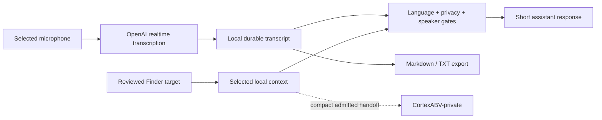

# CoqPi

<p align="center">
  
</p>

<p align="center">
  A private desktop copilot for multilingual calls, interview practice, meeting transcription, and reviewed follow-up.
</p>

<p align="center">
  <a href="https://github.com/markoblogo/CoqPi/actions/workflows/ci.yml"></a>
  <a href="https://github.com/markoblogo/CoqPi/releases/latest"></a>
  <a href="LICENSE"></a>
  
</p>

> **MVP:** CoqPi is useful for local preparation and transcription, but it has not yet completed repeated real-call latency and speaker-attribution validation.

## What it does

CoqPi keeps the communication loop in one desktop app:

- **Live** transcribes an active microphone, follows EN/FR/RU/UK language changes, and prepares one short response.
- **Monitor Live** can send finalized `OTHER` text to the selected MN7R client, show a temporary BID/OFFER draft and scrollable opposite-side market options, then save to Draft Inbox only after a click.
- **Transcribe** records a plain local meeting transcript without assistant analysis.
- **Training** supports interview rehearsal and language correction with local feedback history.
- **Prepare** builds a reviewed session brief from explicitly selected context.
- **Finder** collects and evaluates bounded job, partner, investor, and accelerator candidates.

Your speech can be marked as **ME** by holding Space in the focused Live window or toggling **Говорю я**. It remains in the local transcript but is excluded from assistant suggestions.

## Privacy and authority

CoqPi is local-first, but OpenAI-backed transcription and assistant features send the selected audio or prompt context to OpenAI.

- Secrets stay in the Electron main process and may be stored with macOS secure storage.
- Runtime profiles, transcripts, context packs, receipts, and OAuth tokens stay outside the Git repository.
- Assistant requests pass through a local privacy gate that redacts recognized contact/tracking data and blocks secret-like material.
- Gmail sending and Calendar creation require explicit, hash-bound user approval.
- The Monitor bridge is disabled by default, requires explicit client-speech permission, keeps its token in macOS secure storage, and never sends `ME`, partial, or system transcript items.
- CoqPi cannot autonomously join calls, control other apps, send messages, or publish content.
- CortexABV handoff accepts compact, reviewed artifacts only; raw transcripts and cross-tenant promotion remain denied.

See [Cortex context contract](docs/CORTEX_CONTEXT_CONTRACT.md) and [agent operations contract](docs/AGENT_OPERATIONS_CONTRACT.md).

## Install the latest macOS build

The current public build targets Apple Silicon Macs.

1. Open [the latest release](https://github.com/markoblogo/CoqPi/releases/latest).
2. Download `CoqPi-<version>-arm64.zip` and `SHA256SUMS.txt`.
3. Verify the checksum, extract the archive, and move `CoqPi.app` to Applications.
4. Because the app is unsigned, open it with right click → **Open** when macOS asks.

Replacing the app does not remove local data under `~/Library/Application Support/coqpi`.

## Run from source

Requirements:

- Node.js 22.12 or newer;
- pnpm 11;
- macOS for the packaged desktop app;
- an OpenAI API key for realtime transcription and OpenAI assistant responses.

```bash
git clone https://github.com/markoblogo/CoqPi.git
cd CoqPi
pnpm install
cp .env.example .env
pnpm dev
```

Set `OPENAI_API_KEY` in `.env`, or save it through Settings. Optional Brave Search and Google OAuth credentials enable their bounded Finder workflows.

The default fast-response model is `gpt-5.6-luna`; the realtime transcription default is `gpt-realtime-whisper`. Both can be overridden in `.env`.

## First useful test

1. Open **Training** and submit one short mock interview question.
2. Check the answer, language, model, and latency.
3. Open **Transcribe**, select the microphone and language, and record a short local sample.
4. Export it and confirm that the Markdown/TXT file contains the expected finalized text.
5. Only then try a short Live call.

For the brokerage bridge, open the selected Monitor client in Light or Detailed View, choose `Copy CoqPi setup`, paste it into `Settings → Monitor`, connect the normal Monitor account, confirm permission, enable the bridge, and save. During Live, use `Говорю я`/Space for your own speech. The market preview is temporary until `Save to Monitor Draft Inbox` is selected.

For the real-provider checklist, use [Realtime smoke test](docs/REALTIME_SMOKE_TEST.md). For storage and recovery, use [Meeting transcription mode](docs/MEETING_TRANSCRIPTION_MODE.md).

## Speaker controls

- Hold **Space** before speaking while CoqPi is focused; release it when finished.
- Use **Говорю я** for longer answers or while switching to Meet/Zoom.
- Stop the session before reviewing or exporting it.

This is manual marking, not voice biometrics. If both speakers share one uninterrupted transcription item, CoqPi conservatively excludes that item from suggestions. See [Manual speaker mode](docs/MANUAL_SPEAKER_MODE.md).

## Architecture



Electron main owns secrets, filesystem access, provider calls, and narrow IPC handlers. React renders the operator surfaces. Simple Assistant uses only the selected Markdown profile, selected scenario, and recent transcript; the legacy retrieval path remains available separately.

Read [Architecture](docs/ARCHITECTURE.md) for the full data flow and [Conversation delivery order](docs/CONVERSATION_DELIVERY_PLAN.md) for current acceptance gaps.

## Verification

```bash
pnpm check
```

The gate checks:

- no runtime/private data is tracked;
- TypeScript and ESLint;
- the complete deterministic Node test suite;
- renderer and Electron builds;
- high-severity dependency advisories.

The Electron UI harness and real microphone test are separate because they require a graphical macOS session:

```bash
pnpm test:conversation-ui
pnpm test:pass2-live-smoke-readiness
```

## Current limits

- Apple Silicon macOS build only; the app is unsigned and not notarized.
- Microphone input only; no system-audio capture.
- Microphone raw-audio backup writes local WAV/PCM files next to the transcript
  manifest, but retranscription from that audio is not connected yet.
- Speaker attribution is manual and cannot split one mixed speech item.
- Monitor live preview depends on a selected client, an authenticated Monitor account, and correct manual `ME`/`OTHER` marking; it never creates or sends an operational BID/OFFER/TRADE.
- Live quality and p50/p95 response latency still need repeated real-call measurement.
- Finder is bounded and owner-triggered; no mass crawling or automatic outreach.
- Gmail and Calendar integrations require local OAuth setup and explicit approval.
- Local Ollama can provide controlled text fallback, but there is no offline realtime STT.

## Documentation

- [Architecture](docs/ARCHITECTURE.md)
- [Conversation delivery order](docs/CONVERSATION_DELIVERY_PLAN.md)
- [Realtime smoke test](docs/REALTIME_SMOKE_TEST.md)
- [Meeting transcription](docs/MEETING_TRANSCRIPTION_MODE.md)
- [CortexABV boundary](docs/CORTEX_CONTEXT_CONTRACT.md)
- [Opportunity-to-call workflow](docs/OPPORTUNITY_TO_CALL.md)
- [Security policy](SECURITY.md)
- [Contributing](CONTRIBUTING.md)
- [Changelog](CHANGELOG.md)

## License

[MIT](LICENSE)

<!-- ABVX:ECOSYSTEM:BEGIN -->
## ABVX ecosystem

- [AGENTS.md_generator](https://agentsmd.abvx.xyz/) — Keeps repository guidance and machine-readable context current. Current release: `v0.5.1`.
- [abvx-agent-skills](https://abvx.xyz/work/abvx-agent-skills) — Uses shared, reviewable agent capabilities during maintenance. Current release: `v0.15.0`.

_This block is generated from the reviewed ABVX ecosystem registry._
<!-- ABVX:ECOSYSTEM:END -->
