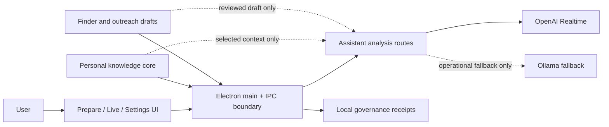

# CoqPi

<div align="center">
  
</div>

CoqPi is a private local desktop application for stressful interview and professional call situations in English and French. It runs as an Electron + React + TypeScript app, keeps API access in the Electron backend, and is designed to stay readable under pressure.

## System Map



Keep this diagram updated when CoqPi changes its main surfaces, assistant routes, context boundaries, or local governance flow.

## Current product blocks

### 1. Live assistant and translator

- OpenAI Realtime microphone transcription for English/French calls.
- Automatic assistant analysis after completed utterances, with manual override.
- Russian explanations: short meaning, detected question, answer options in EN/FR, answer meaning, and keywords to remember.
- Local EN/FR guard ignores obvious Russian/Cyrillic background speech and too-short noise before auto-analysis.
- Live cockpit shows listening status, ignored transcript count, assistant freshness, active pack context, timeout/budget/retry diagnostics, and recovery actions.
- Mock Transcript Mode covers job interview, investor call, partner call, French interview, and mixed EN/FR scenarios without using the microphone.
- OpenAI remains the primary assistant provider; Ollama can be used as text-analysis fallback only for operational/provider errors.

### 2. Finder for jobs, partners, investors, and accelerators

- Local search jobs and candidate results are stored under the Personal Knowledge Core `finder/` directory with provenance, content hashes, append-only events, and status history.
- Current statuses are `draft`, `ready`, `imported`, and `rejected`.
- Finder Runner payload ingress accepts manual/mock JSON from a future search module, soft-accepts valid candidates, returns item errors, and does not browse or scrape from this path.
- The selected Finder job can also run a bounded local `manual_mock` runner that generates deterministic placeholder candidates for review/scoring/import tests. It performs no web search, scraping, API call, scheduler work, or outreach.
- Finder import preview now uses an explicit decision layer by candidate: `ready`, `usable`, `weak`.
  - `ready` / `usable`: auto-select by default and importable immediately when selected.
  - `weak`: not auto-selected and requires explicit "confirm import despite weak quality" before it can be imported.
  - Mixed selection is now gated: if weak selected entries are still unconfirmed, import/session attach is blocked instead of silently importing only the stronger subset.
  - The generic Finder payload preview now has the same decision controls as owner-source preview: `Select ready`, `Select usable`, `Select weak`, plus visible blocked-selection counts before import.
- Real Finder Source Adapter v1 accepts owner-pasted URLs, vacancy/export text, LinkedIn-style job snippets, accelerator/program snippets, investor/fund lists, partner exports, and CSV-like candidate exports for the selected job. It now uses deterministic format-specific parsers (`url`, `structured_fields`, `linkedin_job`, `accelerator_snippet`, `investor_list`, `partner_export`) to extract and enrich company/partner, role/opportunity, location, contact, deadline, relevance, and missing information before preview. URLs are normalized locally only; no fetch is performed.
- Candidate review fields (`fitScore`, `whyRelevant`, `missingInfo`, `nextAction`) are scenario-aware for job, partner, investor, and accelerator flows; the UI explains fit score signals and missing improvements before outreach prep.
- Prioritized pipeline view sorts and filters candidates by fit score, status, next action, and decision state so the Finder tab works as a review funnel.
- Queue review adds compact `import now / hold / reject` lanes with local batch actions, recovery from explicit hold/reject states, and import/hold outreach visibility.
- Outreach prep pack summarizes the focused candidate before action: target, opportunity, fit, why relevant, known context, questions to ask, opening message, next action, and weak-field warnings.
- Outreach draft handoff saves the focused prep card as a local append-only draft in Finder source truth; nothing is sent externally.
- Queue lanes show opening-message preview directly, whether a draft already exists, and quick actions to create/copy/use the draft in session without leaving the lane card.
- Outreach drafts have a local-only execution-prep status: `draft` or `ready_for_contact`. This status is for owner workflow only and does not imply that anything was sent externally.
- Saved outreach drafts can be reviewed per search job, copied as a source-bound markdown export, attached to the active session prep, and batch-marked `ready for contact` locally.
- Importing a candidate creates a selected counterparty pack for the active session.

### 3. Personal knowledge and session context

- Local profile context plus per-call session fields: company, role, context, goal, notes, selected counterparty packs, and the selected Finder outreach draft.
- Counterparty packs include source, owner, classification, retention, scope, links, quality diagnostics, and session eligibility.
- Prepare and Live include a compact session payload inspector: included packs, dropped selected packs with reasons, selected/missing outreach draft, compact relationship status, last-contact label, follow-up context, and profile status. It surfaces the assistant boundary without showing raw source contents.
- Context Sources have explicit local adapter types for owner profile/CV files, counterparty material files, public profile links, company/respondent links, and local folder pointers. Only explicitly selected readable file adapters can be captured for retrieval; links and folders remain provenance-only.
- Context Sources show a safe extraction preview before use: title, adapter type, classification, missing fields, retrieval readiness, extraction mode, and provenance hash. The preview is built from local manifest metadata and does not read or expose raw file/link contents.
- Explicitly captured `.md`, `.txt`, `.json`, and `.csv` files get deterministic local extraction fields for preview: owner facts, role/respondent facts, links, dates, and missing fields. No LLM, URL fetch, folder scan, or external upload is used.
- Reviewed extraction fields can be assembled into an unselected context pack draft. A compact review card shows summary, context, links, weak fields, retrieval state, local lifecycle events (`assembled`, `reviewed`, `saved`), and a lifecycle review/filter surface for status, selected/unselected visibility, assistant-ready entries, weak fields, and stale events. Saved weak-free packs can be handed off directly into the active session prep; if the pack is not yet selected for retrieval, CoqPi activates it first and then saves it in `selectedCounterpartyPackIds`.
- The local manifest markdown includes a compact knowledge readiness summary for sources, packs, lifecycle, and future vector candidate-set state.
- Selected pack IDs are revalidated in UI state, session save/load, and assistant analysis. Disabled, removed, duplicate, missing, or non-retrieval-ready packs are pruned before use.
- A selected outreach draft is revalidated against Finder source truth before use. Missing or stale draft IDs are dropped or surfaced in prep quality instead of broadening context.
- Assistant retrieval uses a strict allowlist: when selected pack IDs are provided, only those packs are candidates.
- `retrievalProvider: future_vector` is vector-ready v0: it builds a metadata-only candidate set from the selected, eligible pack IDs, then runs the current local scorer inside that set. It does not add a vector database, broad source search, external fetch, or raw-content exposure.
- Assistant quality fixtures inspect the provider prompt and verify that selected packs are included while unselected packs stay out of the answer path.

### Not implemented yet

- No outbound Finder runner, scheduler, scraping, search APIs, or automatic outreach. The current runnable paths are local/manual mock and owner-pasted source normalization only.
- No email sending or automatic outreach execution; draft export is manual copy-only.
- No system audio routing, voice output, phone integration, or offline realtime STT.
- No full vector RAG/ranking layer yet; current retrieval is strict selected-pack/source context with a `future_vector` readiness contract only.
- No training mode yet.

Prompt/skill improvement is governed by an optional local skill-quality pipeline in [`docs/SKILL_QUALITY_PIPELINE.md`](docs/SKILL_QUALITY_PIPELINE.md). It is for synthetic or explicitly recorded mock transcript evidence only: bounded candidate edits, held-out validation, rejected-edit memory, and owner acceptance before any `best_skill.md` export.

External AI-engineering examples are tracked in [`docs/AI_ENGINEERING_REFERENCE_INDEX.md`](docs/AI_ENGINEERING_REFERENCE_INDEX.md) as references only. They do not install code, change realtime behavior, add providers, or authorize use on live calls.

Selected-context retrieval now has a compact tiering contract in [`docs/SELECTED_CONTEXT_TIERS_CONTRACT.md`](docs/SELECTED_CONTEXT_TIERS_CONTRACT.md): `L0/L1/L2` loading, explicit retrieval receipts, and selected/dropped/stale context observability without adding a context runtime.

Screen-memory ideas are allowed only in a narrow session-scoped form. [`docs/SESSION_MEMORY_BOUNDARY.md`](docs/SESSION_MEMORY_BOUNDARY.md) limits any future adaptation to explicit call/prep/review windows, local/private reviewed artifacts, redaction before persistence, and report-only follow-up analysis. It rejects ambient 24/7 desktop recall, keyboard/clipboard capture, and unrelated operator memory.

Optional continuous code review is allowed in this repository because provider, retrieval, and session-state changes can compound quickly. It stays local/opt-in only: manual, pre-push, and optional post-commit modes are allowed, while daemon-for-everyone, automatic PR comments, and auto-fix-as-policy are not. See [`docs/CONTINUOUS_REVIEW_BOUNDARY.md`](docs/CONTINUOUS_REVIEW_BOUNDARY.md).

Chat-bot architecture is not the default CoqPi product direction. A later chat-facing surface is allowed only inside a narrow boundary: owner/private-test scope, selected-context only, `proposal` authority, and `clarify_or_abstain` for unsupported requests. See [`docs/CHAT_SURFACE_BOUNDARY.md`](docs/CHAT_SURFACE_BOUNDARY.md).

Russian editorial behavior is scoped by [`docs/RU_EDITORIAL_CONTRACT.md`](docs/RU_EDITORIAL_CONTRACT.md). It is a local reference/review layer for Russian explanations and UI copy only; it does not change provider routing, transcript capture, or production logic.

Selected `12-factor-agents` principles are adapted in [`docs/AGENT_EVENT_THREAD_CONTRACT.md`](docs/AGENT_EVENT_THREAD_CONTRACT.md) for CoqPi's local event-thread, selected-context, pause/resume, focused-assistant, and compact-error boundaries. This remains a product contract, not a framework runtime.

## Local installation

1. Install [pnpm](https://pnpm.io/).
2. Run `pnpm install`.
3. Copy `.env.example` to `.env`.
4. Optionally set `OPENAI_API_KEY` in `.env` for development.

## Run in development

- `pnpm dev`
- `pnpm typecheck`
- `pnpm lint`
- `pnpm build`
- `pnpm format`
- `pnpm test:finder-prepare-live-ui` to verify the full Finder -> Prepare -> Live selected-context path without manual selected-ID overrides.
- `pnpm test:finder-ui-state` to verify Finder preview gating, ready/usable/weak selection behavior, and deterministic source-adapter parsing.

## API key setup

CoqPi resolves the OpenAI API key in this order:

1. Secure stored key saved from the app Settings screen
2. `OPENAI_API_KEY` from local `.env`

The renderer never receives the real key value. It can only read safe status booleans.

### In-app key setup

1. Open `Settings / Debug`.
2. Enter the key in `Save secure local key`.
3. Click `Save Stored Key`.

You can also delete the stored key from the same screen. If `safeStorage` is unavailable, CoqPi shows a clear local error and `.env` remains the fallback for development.

## Environment variables

```env
OPENAI_API_KEY=
OPENAI_ASSISTANT_MODEL=gpt-4o-mini
OPENAI_ASSISTANT_MODEL_ECONOMY=
OPENAI_ASSISTANT_MODEL_BALANCED=
OPENAI_ASSISTANT_MODEL_QUALITY=
OPENAI_REALTIME_TRANSCRIPTION_MODEL=gpt-realtime-whisper
OPENAI_REALTIME_TRANSCRIPTION_DELAY=low
OPENAI_SAFETY_IDENTIFIER=coqpi-local-user
COQPI_GOVERNANCE_DIR=./data/governance
COQPI_GOVERNANCE_MODE=shadow
COQPI_ASSISTANT_PROVIDER_PROFILE=openai:0,ollama:50
COQPI_ASSISTANT_FAILOVER_MODE=ordered
COQPI_PERSONAL_KNOWLEDGE_CORE_DIR=./data/context-sources
COQPI_CONTEXT_PACK_SIGNING_KEY=<shared-hmac-key>  # optional, for signed snapshot export
OLLAMA_BASE_URL=http://127.0.0.1:11434
OLLAMA_ASSISTANT_MODEL=llama3.1
COQPI_ASSISTANT_PROVIDER_TIMEOUT_MS=10000
COQPI_ASSISTANT_REQUEST_BUDGET_MS=25000
```

`COQPI_ASSISTANT_PROVIDER_PROFILE` defines the local provider order (priority numbers) for assistant analysis. CoqPi now tries providers in this order for text analysis and falls back when a provider fails (OpenAI → Ollama by default).

Retry behavior for provider fallback:

- Retry happens only for operational/provider transport errors (network/API errors, temporary failures).
- Non-retryable cases: non-retryable provider failures (for example explicit config/authorization failures, schema/contract errors, and non-operational provider errors), plus malformed model responses.
- Timeout and budget behavior:
  - `COQPI_ASSISTANT_PROVIDER_TIMEOUT_MS` caps a single provider attempt.
  - `COQPI_ASSISTANT_REQUEST_BUDGET_MS` caps total analysis routing time across all attempts.
- When route metadata is available, receipts include `routeIndex`, `routeCount`, `routeLabel`, and attempt budget/timeout values.
- Fallback is attempted only when more than one enabled provider is configured. If there is only one provider (for example `COQPI_ASSISTANT_FAILOVER_MODE=none`), there is no second attempt.

- `OPENAI_ASSISTANT_MODEL` remains the fallback assistant model.
- Cost mode overrides can be set with:
  - `OPENAI_ASSISTANT_MODEL_ECONOMY`
  - `OPENAI_ASSISTANT_MODEL_BALANCED`
  - `OPENAI_ASSISTANT_MODEL_QUALITY`

`.env` is local-only and must never be committed.

## Local Governance

External assistant and realtime-provider calls create local JSONL receipts in `data/governance/receipts.jsonl`. They contain only safe operational metadata: correlation ID, action fingerprint, decision, latency, provider/model, and tokens when returned by the provider. Transcripts, context, secrets, prompts, raw errors, and hidden reasoning are excluded.

Receipt writes are best-effort so a local disk failure cannot interrupt a live call.

`shadow` is the default and preserves existing routes. `enforce` is reserved for future tool routes; it can block system writes or require approval for external writes. Local STT/audio has no governance I/O or policy round trip.

## UX modes

- `Live Call`: primary cockpit with realtime health, transcript, Russian meaning, suggested answers, and keywords.
- `Prepare`: mock transcript controls, manual analysis actions, cost counters, and collapsible profile context.
- `Settings / Debug`: secure API key handling, defaults, audio advanced controls, realtime diagnostics, and privacy info.
- Live diagnostics in the `Assist` path now show concise status reasons for timeout/budget/manual errors and direct next-action hints, with a one-click `Reset conversation` action available from the transcript card.
- The `Live` screen includes a compact test cockpit for smoke testing: listening filter, ignored transcript count, automatic transcript window, selected pack context, and fresh/stale assistant state.

## Mock Transcript Mode

Mock mode is for UI testing only.

- It does not use the microphone.
- It does not send audio.
- It follows the same transcript-to-analysis path as a live completed utterance. Analysis therefore calls the configured assistant provider when auto-analysis or a manual action is enabled.
- The scenario selector covers default EN/FR, job interview, investor call, partner call, French interview, and mixed EN/FR prompts.
- The live smoke readiness pack gives one compact status before a call: setup, selected context, mock transcript path, assistant freshness, and real mic readiness.
- The minimal real-test script stays at 5 actions: prep ready, mock probe, assistant probe, mic probe, final check.
- `Reset for test` clears transcript, assistant result/errors, mock playback, checklist marks, cost notice, counters, and realtime timer while preserving profile, session context, selected packs, key, and audio device.
- `Save smoke note` records what worked, what broke, and the next fix to a local `smoke-notes.jsonl` file under the sessions directory; it does not store transcript text.
- The post-smoke fix queue derives the next local fixes from saved smoke notes, deduplicates repeated `Next fix` items, and keeps the first pending fix visible without creating an external tracker.
- `Copy report` turns the latest smoke note and first queued fix into a short markdown summary for pasting into Codex; it does not include transcript text.
- The live smoke checklist keeps local Done/Blocker marks and shows the next active step from current app readiness.

Use it from the `Prepare` tab to populate transcript state and test manual assistant actions safely.

Minimal real-test script when ready:

1. Prep ready — Test panel says ready for mock assistant smoke; otherwise fix Setup or Context gate.
2. Mock probe — enable Mock Transcript Mode and add one EN/FR line; transcript should get a final other-speaker line.
3. Assistant probe — run Analyze 2m or wait for auto-analysis; Assist/Answers should show a fresh answer using the selected pack.
4. Mic probe — start realtime and say one short EN/FR sentence; realtime should listen and transcript should update.
5. Final check — stop realtime and check the latest assistant answer; it should be fresh, short, and tied to the selected pack.

### Test commands

- `pnpm test:governance` — governance + context pack + knowledge readiness + failover policy tests.
- `pnpm test:session-pack-selection` — selected counterparty pack cleanup and auto-add rules.
- `pnpm test:live-loop-ui` and `pnpm test:analyze-recent-transcript` — live-loop selected-pack scheduling and assistant routing regressions.
- `pnpm test:pre-smoke` — one-command non-microphone pre-smoke set: mock scenarios, selected packs, live-loop UI, and assistant routing.

### Verified local flow

On 2026-07-20, the local flow was manually verified with a selected plaintext CV source:

1. The source was explicitly captured and classified as private for `coqpi_interview_en_fr`.
2. Mock English interview questions followed the normal transcript-to-analysis path.
3. The assistant used the scoped CV evidence in its English response suggestions.

This does not validate unsupported document formats, links, folders, or live-call transcript accuracy.

## Profile context

The profile context lives in:

- [data/profile/profile_context.md](/Users/antonbiletskiy-volokh/Downloads/Projects/CoqPi/data/profile/profile_context.md)

Edit that file manually in your editor, then use `Reload Profile` inside the app. The profile text can optionally be included in assistant requests, and the current setting is controlled from `Settings / Debug`.

Context source governance is also available in the local Personal Knowledge Core folder:

- `data/context-sources/manifest.json`
- `data/context-sources/coqpi-context-pack.manifest.md`
- `data/context-sources/coqpi-context-pack.history.jsonl`

### Handoff snapshot to Cortex (no UI required)

- `pnpm dump-manifest -- --dump-manifest`
- `pnpm dump-manifest -- --dump-manifest --manifest-dir ./data/context-sources --output ./handoff.snapshot.json`
- `COQPI_CONTEXT_PACK_SIGNING_KEY=... pnpm dump-manifest -- --dump-manifest --sign`
- `pnpm dump-manifest -- --validate --manifest-dir ./data/context-sources`  
  (fails on invalid `manifest.json` / chain mismatch)
- `pnpm dump-manifest -- --handoff`  
  (runs validate + writes `handoff.validation.json`, then writes `handoff.snapshot.json`; aborts snapshot on validation fail)
- `pnpm dump-manifest -- --handoff --validate-output ./handoff.validation.json --snapshot-output ./handoff.snapshot.json`  
  (explicit output paths)

Shortcuts:

- `pnpm handoff`
- `pnpm handoff:signed`
- `pnpm handoff:with-dates`
- `pnpm handoff:with-dates:signed`
- `pnpm handoff:with-dates:reject-partial`

Snapshot output includes:

- canonical `manifest.json` state,
- optional `history` entries,
- `manifestHash` for integrity,
- optional HMAC `signature` if `--sign` is set.

## Realtime smoke test

Manual realtime verification steps are documented in:

- [docs/REALTIME_SMOKE_TEST.md](/Users/antonbiletskiy-volokh/Downloads/Projects/CoqPi/docs/REALTIME_SMOKE_TEST.md)

## Local macOS packaging

Build unsigned local artifacts with:

- `pnpm pack:mac`
- `pnpm dist:mac`

Output goes to:

- `dist-packages/`

Notes:

- Packaging excludes `.env` files.
- No code signing or notarization is configured.
- No GitHub release flow is configured.
- On macOS, an unsigned app may require right-click -> `Open`.

## Project structure

```text
src/
  main/       Electron main process and preload
  renderer/   React UI, tabs, realtime client, audio UI
  backend/    Local backend services
  shared/     Shared types and cost/transcript helpers
data/
  profile/    Local profile context markdown
  sessions/   Future local session artifacts
  context-sources/
             Ingress manifest + markdown + local change history
  governance/ Append-only safe provider receipts
docs/
  ARCHITECTURE.md
  REALTIME_SMOKE_TEST.md
  UX_PRINCIPLES.md
```

## Next development passes

1. Finder candidate lifecycle pass: add clearer review states for enriched / needs-info / ready-for-outreach.
2. Knowledge pack lifecycle review pass: improve filtering/review of lifecycle events and connect them to handoff summaries for Cortex intake.
3. Live microphone tuning: run the short real-call smoke and tune turn segmentation/noise behavior from observed failures.
4. Training mode foundation: reuse the same selected profile/session/pack/draft context for interview and negotiation rehearsal.

The local STT reference and licensing boundary are recorded in [docs/ARCHITECTURE.md](/Volumes/Work/Work/CoqPi/docs/ARCHITECTURE.md).

## Agent operations

Named agents, long-running work, memory scopes, and provider capability claims follow the local [Agent Operations Contract](docs/AGENT_OPERATIONS_CONTRACT.md). It is descriptive and fail-closed: schedules and provider configuration never grant external-action authority.
