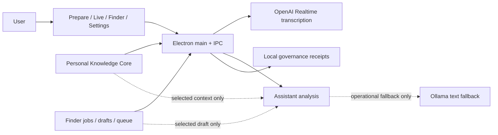

# CoqPi

<div align="center">
  
</div>

CoqPi is a local Electron app for three connected jobs:

1. help during real English/French calls with fast Russian support;
2. find and prepare job / partner / investor / accelerator targets before the call;
3. accumulate private owner/context knowledge without sending raw source material into the assistant path.

OpenAI Realtime is the primary live transcription path. OpenAI text analysis is primary for assistant replies. Ollama is available only as controlled text fallback.

## Current product status

### 1) Communicator: live assistant / translator

Status: MVP is real and fairly stable.

What works now:
- mic input -> realtime transcript -> assistant answer loop;
- EN/FR -> RU meaning, detected question, short answer options in EN/FR, answer meaning, keywords;
- auto-analysis after final `other` utterances with manual override;
- real-call boundary hardening for:
  - background non-EN/FR speech,
  - short noise,
  - acknowledgement noise,
  - rapid duplicate finals,
  - rapid consecutive finals that likely belong to one thought;
- stale/retry/timeout/budget diagnostics;
- selected pack + selected outreach draft flow into assistant payload;
- live cockpit shows what is listened to, what is ignored, what was sent, and what context actually went into the last analyze;
- real-smoke execution diagnostics now show:
  - first failed stage,
  - compact realtime/transcript trace,
  - one-click capture into a local smoke note.

Still not done:
- real-call tuning is stronger now, but still not fully validated by repeated live calls;
- no system-audio capture;
- no offline/local realtime STT.

### 2) Finder: jobs / investors / accelerators / partners

Status: strong local foundation, but not autonomous search yet.

What works now:
- local Finder jobs and candidate pipeline;
- manual/mock runner contract;
- source adapter preview for pasted URL/text/export inputs;
- one explicit public URL -> local preview candidate flow for job/fund/accelerator/company pages;
- optional Crawl4AI markdown fallback for weak/thin `public_page_v1` previews only, keeping the deterministic Cheerio/Crawlee path as the default fast path;
- supervised `manual_complex_page_v1` escape hatch for difficult public pages: same URL, but with owner-reviewed notes/markdown pasted manually after a weak preview;
- parser pack set v1:
  - `job_page_v1`
  - `investor_fund_v1`
  - `accelerator_program_v1`
  - `company_profile_v1`;
- deterministic parsing and field extraction for vacancy/job, accelerator, investor/fund, company/partner, and CSV-like inputs;
- stronger deterministic parsing for messy real-world pages and section-style fields before falling back to manual review;
- quality tiering before import: `ready / usable / weak`;
- queue review, hold/reject/import decisions;
- outreach prep and local outreach drafts;
- stronger queue -> session handoff:
  - `import_now / hold_later / rejected`,
  - `ready_for_contact / contacted / waiting / follow_up / closed`,
  - immediate Prepare/Live effect on the next call payload.

Still not done:
- no live web search engine, scraper, scheduler, or outbound sender;
- public web ingress is still bounded single-page fetch, not broad crawling;
- no automatic outreach.

### 3) Knowledge / RAG-like layer

Status: practical selected-context layer exists; heavy RAG stack does not.

What works now:
- local profile context;
- local context sources with provenance, hash, classification, retention;
- extraction preview from explicitly selected readable files;
- document ingestion via local MarkItDown adapter for explicit `pdf/docx/pptx/xlsx/xls/html` files, still ending in compact extracted fields only;
- parser pack set v1 is inferred on compact extraction so Knowledge and Finder use the same `job/investor/accelerator/company` routing vocabulary;
- reviewed pack assembly and lifecycle states;
- selected-pack retrieval boundary and session handoff into Prepare/Live;
- strict payload audit for what is included vs dropped;
- vector-ready contract exists, but retrieval still runs inside a strict selected candidate set without a vector DB.

Still not done:
- no full vector retrieval infrastructure;
- no broad automatic ingestion from links/folders/web.

## Architecture



## Safety boundaries

- raw files are not pushed directly into assistant requests;
- assistant retrieval is limited to selected eligible packs;
- governance receipts store only operational metadata;
- smoke notes do not store transcript text;
- Finder/outreach remains local-only and does not send anything externally.

## Local setup

1. Install `pnpm`.
2. Run `pnpm install`.
3. If `pnpm` asks for ignored builds, run:
   - `pnpm approve-builds`
4. Copy `.env.example` to `.env`.
5. Set `OPENAI_API_KEY`.

Useful env vars:

```env
OPENAI_API_KEY=
OPENAI_ASSISTANT_MODEL=gpt-4o-mini
OPENAI_REALTIME_TRANSCRIPTION_MODEL=gpt-realtime-whisper
OPENAI_REALTIME_TRANSCRIPTION_DELAY=low
COQPI_ASSISTANT_PROVIDER_PROFILE=openai:0,ollama:50
COQPI_ASSISTANT_FAILOVER_MODE=ordered
OLLAMA_BASE_URL=http://127.0.0.1:11434
OLLAMA_ASSISTANT_MODEL=llama3.1
COQPI_ENABLE_CRAWL4AI_ENRICHMENT=0
COQPI_CRAWL4AI_PYTHON=
COQPI_PERSONAL_KNOWLEDGE_CORE_DIR=./data/context-sources
COQPI_GOVERNANCE_DIR=./data/governance
```

Optional Finder enrichment:
- default `public_page_v1` uses the current bounded `@crawlee/cheerio` fetch path;
- optional Crawl4AI markdown enrichment is attempted only for thin/weak deterministic previews;
- enable it explicitly with `COQPI_ENABLE_CRAWL4AI_ENRICHMENT=1` or point `COQPI_CRAWL4AI_PYTHON` to a ready Crawl4AI Python runtime;
- if enrichment is unavailable or fails, Finder keeps the deterministic preview and does not fail the request.
- if both automatic paths are still weak, the owner can switch to supervised `manual_complex_page_v1` and paste reviewed page notes for the same URL; CoqPi still stays local and does not automate a browser or outbound action.

## Run

- `pnpm dev`
- `pnpm build`
- `pnpm typecheck`
- `pnpm lint`

Useful handoff scripts:

- `pnpm handoff`
- `pnpm handoff:signed`
- `pnpm handoff:with-dates`
- `pnpm handoff:with-dates:signed`
- `pnpm handoff:with-dates:reject-partial`

## Recommended test commands

- `pnpm test:live-loop-ui`
- `pnpm test:analyze-recent-transcript`
- `pnpm test:assistant-output-quality`
- `pnpm test:finder-ui-state`
- `pnpm test:finder-prepare-live-ui`
- `pnpm test:governance`
- `pnpm test:pre-smoke`

## Real smoke path

Use the `Test` tab.

The current recommended order:

1. Confirm the readiness card is at least ready for mock.
2. Run one mock EN/FR utterance and confirm a fresh assistant answer.
3. Check the execution diagnostics card:
   - first failure, if any;
   - latest realtime/event trace;
   - ignored boundary breakdown;
   - `Capture current state` if you want to save the current failure into the smoke note draft.
4. Start a short realtime probe with one clear EN or FR sentence.
5. Save a smoke note only after the probe, not before.

Detailed version: [docs/REALTIME_SMOKE_TEST.md](docs/REALTIME_SMOKE_TEST.md)

For operator-facing execution docs and smoke/runbook steps, prefer an
ADHD-shaped layout: next action first, numbered bounded steps, visible current
state, concrete estimates when relevant, and one explicit next move.

For live-assist, Finder, and governance work, keep one compact loop
vocabulary: `Discuss -> Plan -> Execute -> Verify -> Ship`.
Heavy research, planning, and execution belong in bounded fresh packets while
the main operator thread stays lean. No ship or workflow-ready claim is valid
without a verification artifact, receipt, smoke note, or reviewed evidence for
the scoped path.

## Important local docs

- [docs/ARCHITECTURE.md](docs/ARCHITECTURE.md)
- [docs/REALTIME_SMOKE_TEST.md](docs/REALTIME_SMOKE_TEST.md)
- [docs/CORTEX_CONTEXT_CONTRACT.md](docs/CORTEX_CONTEXT_CONTRACT.md)
- [docs/SELECTED_CONTEXT_TIERS_CONTRACT.md](docs/SELECTED_CONTEXT_TIERS_CONTRACT.md)
- [docs/SESSION_MEMORY_BOUNDARY.md](docs/SESSION_MEMORY_BOUNDARY.md)
- [docs/CONTINUOUS_REVIEW_BOUNDARY.md](docs/CONTINUOUS_REVIEW_BOUNDARY.md)

`docs/CONTINUOUS_REVIEW_BOUNDARY.md` also defines the optional local
`Open Code Review` (`ocr`) pass used as a second reviewer on diffs before
push/PR. It is advisory only and does not replace smoke/governance checks.

## Not in scope yet

- outbound email or message sending;
- autonomous Finder crawling/searching at scale;
- training mode;
- full local/offline voice stack;
- broad RAG appliance or separate vector infrastructure.
